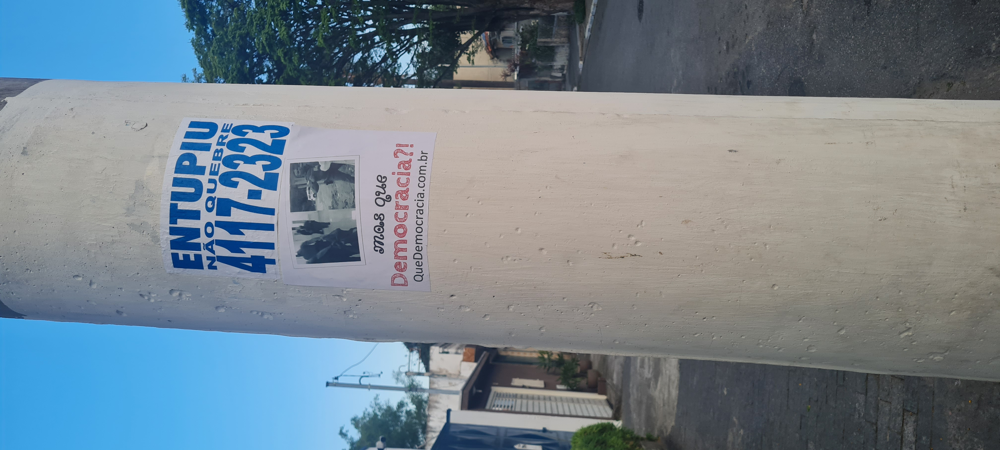
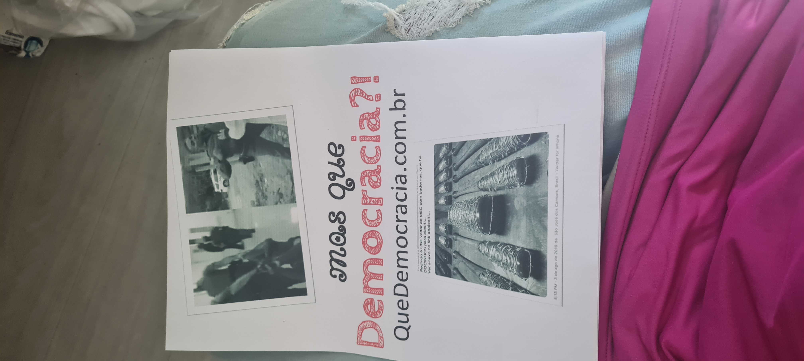
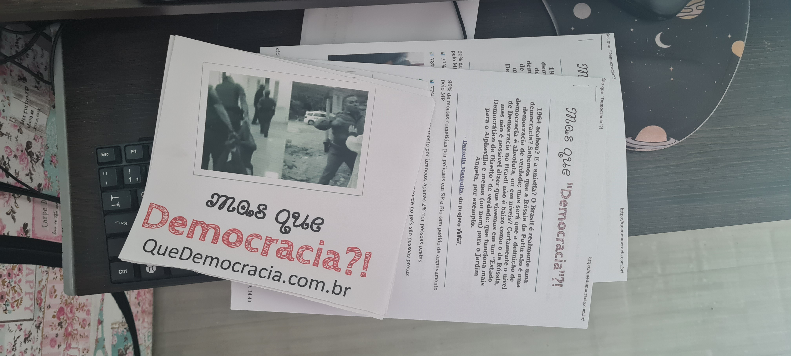

**Me expus à enfrentar as possíveis multas municipais exclusivas das cidades de São Paulo (coração financeiro do Brasil onde o higienismo impera) e outros tipos de represálias, pois desde 2012 sentimos o peso do braço forte de um Estado que deveria proteger às "minorias"; de um Estado que prioriza à Econômia Neoliberal e ao Militarismo em detrimento ao prometido Estado (pseudo)Democrático de (poucos)Direitos.**

<!--more-->

----

Disse o Nobel de Literatura [José Saramago](https://democraciasegura.com.br/): não se discute a democracia, ao contrário de todos os outros assuntos.

<blockquote>
"a democracia em que vivemos é uma democracia sequestrada, condicionada, amputada..."
 - José Saramago
</blockquote>

E segundo a freira catalã [Teresa Forcades](https://www.dn.pt/globo/europa/vivemos-num-mundo-de-falsas-democracias-3530184.html): o mundo é hoje um conjunto de "falsas democracias", com o poder político subordinado à economia; apontando como "maior fonte de esperança no futuro" um movimento anticapitalista pacífico e democrático.

<!--Inicio a postagem com uma nota pessoal: o site QueDemocracia foi sim divulgado pela Internet, porém até mesmo influencers das causas sociais no máximo comentaram, porém não passaram a mensagem adiante.-->

----

# rascnhos:

- ao todo 4 panfletos, sobrando 2: nos postes perto do conselho tutelar itaquera, conselho tutelar aricanduva, ubs II, ubs I
- ao contrario do anuncio de desentupimento, o quedemocracia é sem fins lucrativos, e visa levantar questões sociais, morais, ambientais e políticas
- um ato de desespero, de protesto e, por fim, de arte
- nao utilizei cola natural, peguei A4 adesiva na pressa
- recortei os tacos farpados curtidos pelo Abraham Weintraub pois a oposiçao poderia acusar que a mensagem passada pelos lambe-lambes seria completamente outra; e por acaso ficou parecido com o formato A3
- a ideia de "cidade limpa" inclui: https://g1.globo.com/Noticias/SaoPaulo/0,,MUL90866-5605,00-SEMTETO+TEM+COBERTOR+MOLHADO+ANTES+DE+ATO+NO+CENTRO.html https://g1.globo.com/sp/sao-paulo/noticia/2021/02/02/padre-julio-lancelotti-quebra-a-marretadas-pedras-instaladas-sob-viadutos-pela-prefeitura-de-sp.ghtml), e sabemos: uma elite que odeia tanto ao pobre, quanto à arte e à cultura: porque estas tem o poder de levar a populacao ao conhecimento e despertar o senso critico, assim podendo questionar e investigar o poder. nao é so em protesto que jogam agua em pessoas em situaçao de rua: https://oglobo.globo.com/politica/moradores-de-rua-sao-acordados-com-jatos-de-agua-fria-em-sp-diz-cbn-21607407. a mesma lei cidade limpa nao é fiscalizada quando o capitalismo predatorio é alimentado: https://archive.is/nRLqW#selection-3723.7-3751.369
- nao pude trazer muita cor por falta de tinta

<blockquote>
Em espaços públicos, postes, pontes, lixeiras, paredes de locais abandonados e muito degradados em que colar um lambe pode trazer cor e graça para a quantidade de cinza em nossas cidades.

Nos espaços privados, como muros e portões, é necessário pedir autorização ao dono ou responsável. Dependendo da mensagem e do dono do muro, o ato de pedir pra colar seu lambe pode ser autorizado e ainda render uma bela conversa. Se a pessoa não topar, respeite. Todos tem o direito de dizer não.

Vale lembrar que o lambe é como um adesivo. E a sua cola é feita em geral com água, farinha de trigo ou polvilho, ou ainda com cola branca. Todos os ingredientes possíveis têm pouco potencial de gerar estragos severos e permanentes na superfície colada.
</blockquote>

----

> A cidade é um espaço em disputa com ideias muitas vezes divergentes sobre a melhor forma de atuar no espaço público. O ato de colar um lambe-lambe deve propiciar uma conversa saudável sobre qual modelo de cidade queremos, e de jeito nenhum gerar mais animosidade nessa disputa de ideias.
> 
> Papel
> 
> O tamanho ideal para lambe-lambe é o A3, que fica suficientemente visível e cabe mesmo em espaços reduzidos, como postes e lixeiras. Mas você pode considerar formatos maiores se tiver conseguido autorização para colar num muro grande, por exemplo.
> 
> O papel não pode ser feito em impressora jato de tinta, senão durante a aplicação da cola, sua mensagem vai ficar borrada. O melhor são impressoras a laser ou offset. Vale também ir numa gráfica perto da sua casa com o pdf na mão e explicar a finalidade da impressão. Às vezes sai bem mais barato.
> 
> Além disso, o papel não pode ser muito grosso, pra não ficar difícil de colar. O ideal é uma gramatura de 75g/m2 ou 90g/m2.

https://catracalivre.com.br/cidadania/lambe-lambe-no-muro-e-uma-ideia-na-cabeca/

<!--**Replace with Rest of Content**-->
